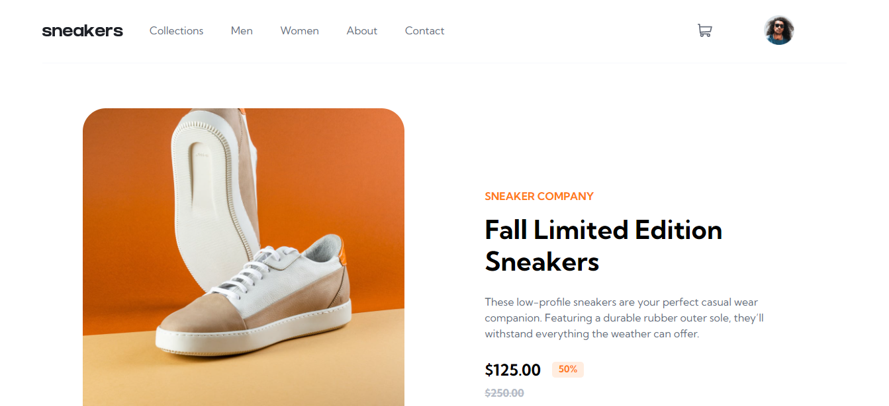

# Frontend Mentor - E-commerce product page
This is a solution to the E-commerce product page challenge on Frontend Mentor.

### Screenshot

## Links
-Solution URL: [Github](https://github.com/juanmderosa/ecommerceProductPageMain)
-Live Site URL: [Github Pages](https://juanmderosa.github.io/ecommerceProductPageMain/)

## Built with
-Semantic HTML5 markup
-CSS custom properties
-Flexbox
-CSS Grid
-Mobile-first workflow
-Responsive Design
-Javascript